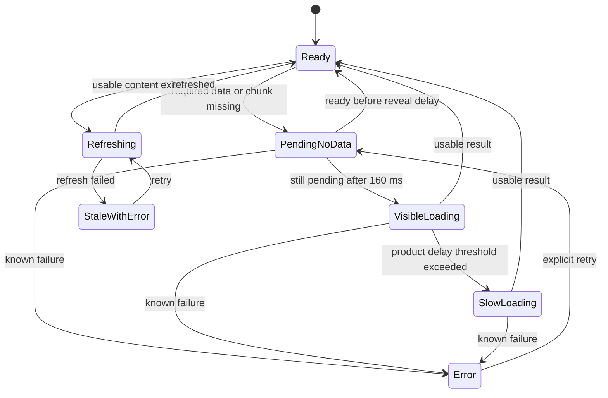

# Motion, gestures, loading, and perceived performance

Status: implementation plan, not completed remediation. Source inspection and external research: 2026-09-27. No device recording, runtime profiling, or gesture test was performed for this document. Read with [accessibility](07-accessibility.md) and the plan index. Proposed timing values below are BRACK design targets to validate, not measurements or platform requirements.

Implementation update: F04 supplies immediate AddBook completion, semantic haptics and bounded local context gestures in the [action feedback contract](../ui-action-feedback.md); see [checkpoint 15](15-feedback-environment-batch.md) for actual validation. Broader animation changes, native gesture arbitration and performance measurements remain planned. Baseline findings below describe the original audit.

## 1. Evidence and priority

Current coverage correction: [RM01–RM09](coverage-review/05-loading-motion-and-global-surfaces.md) trace live App/Suspense, route animation, loading callers, onboarding waiting, toast/reward ownership and native wrapper boundaries. [Active20](20-coverage-reconciliation.md) requires missing foundational work and relevant performance baselines before routine F10 progression; F19 is not a waiver for action-imposed waiting or unsupported route-performance claims.

F07 update: [checkpoint 17](17-back-ownership.md) and [local gestures](../ui-local-gestures.md) record retirement of duplicate edge navigation and disconnected pull-dismiss, plus cancellation/axis/overlay guards for existing row and refresh gestures. These address the relevant baseline findings below. They do not establish measured navigation latency or verified native route transitions; broader brand motion remains F19 work.

Graphify was queried before scoped source reads. Its broad query was truncated; the source files below were then inspected directly. Graph relationships locate owners; current source establishes behavior. `apps/client/src/` is abbreviated as `src/` in this document.

| ID | Evidence class | Finding and consequence | Implementation owner and priority |
|---|---|---|---|
| M01 | Confirmed source | `App.tsx` mounts `SwipeBackHandler`; detail `MobileHeader` instances also call `useSwipeBack`. More than one eligible hook can attach document listeners. Duplicate navigation during an actual gesture is a risk, not a reproduced result. | `components/SwipeBackHandler.tsx`, `components/MobileHeader.tsx`; P1 navigation correctness |
| M02 | Confirmed source | `useSwipeBack` puts `swipeDistance` in its effect dependencies, updates React state on moves, and reattaches listeners. It derives eligibility from `window.history.length`, has no `touchcancel` handler, and delays `navigate(-1)` by 200 ms. Browser history may include external pages. | `hooks/useSwipeBack.ts`; P1 |
| M03 | Confirmed source | `detectPlatform` uses user-agent iPhone/iPad/Android matching. The back and drawer hooks use this classification, not Capacitor runtime identity. They can operate in mobile browsers and miss iPad desktop user agents. The right-edge hook's comment claiming no browser conflict is not evidence of safety. | `lib/platform.ts`, `hooks/usePlatform.ts`, `hooks/useSwipeToOpenDrawer.ts`; P1 |
| M04 | Confirmed source | `PageTransition` watches pathname after route rendering and fades the same container out for 150 ms and back in for 250 ms. It does not retain an outgoing route. Calling its first phase an old-page exit overstates what the code does. | `components/animations/PageTransition.tsx`, `App.tsx`; P1 |
| M05 | Confirmed source; effect unmeasured | The root `Suspense` boundary is above `BrowserRouter` and uses a fullscreen branded fallback. Lazy route chunks can reach this broad boundary. Whether it flashes or interrupts a given navigation needs a controlled cold-chunk trace. | `App.tsx`; P1 |
| M06 | Confirmed source | Manual Add Book success waits 1,500 ms before library navigation; quick add navigates directly. First-book confetti is scheduled for 3,000 ms. The timer is a real interaction delay even when storage has completed. | `screens/AddBook.tsx`, manual submit handler; P1 |
| M07 | Confirmed source, preserve | `BrackLoader` already delays appearance 160 ms, limits its motion sequence to 1,650 ms, pauses when hidden/offscreen, has reduced-motion/reduced-data states, uses BRACK mark assets, and exposes status/progress semantics. | `components/animations/LogoSpinner.tsx`, `brackLoaderTokens.ts`, `BrackLoader.css`; improve placement and art direction rather than reset its contracts |
| M08 | Confirmed source, preserve | `LoadingRegion` retains children, distinguishes refresh from initial loading, places its announcement outside `aria-busy`, and has a retry error companion. | `components/loading/LoadingRegion.tsx` |
| M09 | Confirmed source, preserve | Reward feedback has confirmed batches, account scoping, deduplication, queue expiry/aggregation, foreground checks, a polite announcement, and reduced-motion branches. Streak celebrations use a dialog, a dismiss control, focus handling, and reduced motion. | `contexts/RewardFeedbackContext.tsx`, `components/StreakCelebrationOverlay.tsx`, `hooks/useStreakCelebration.ts` |
| M10 | Confirmed source | Native `selection` haptic falls through to `ImpactStyle.Heavy`; `ContextMenuNative` requests a medium haptic after `useLongPress` already requested one. | `hooks/useHapticFeedback.ts`, `hooks/useLongPress.ts`, `components/ui/context-menu-native.tsx`; P1 |
| M11 | Confirmed source | `useLongPress` has a 500 ms timer but no movement cancellation, touch cancellation, or unmount cleanup. Scrolling or interrupted contact can leave its timer active. | `hooks/useLongPress.ts`; P1 |
| M12 | Confirmed source, preserve | `SwipeableBookCard` already has axis locking, damped overscroll, touch cancellation, post-swipe click suppression, reduced-motion release, and delete confirmation. Its wrapper alone does not provide a non-swipe reveal; audit each composed card's menu. | `components/SwipeableBookCard.tsx`; retain working protections |
| M13 | Confirmed source | `HeartLike` has a GSAP scale/bounce without a reduced-motion guard. Global CSS shortening cannot cancel JavaScript timelines. Shared buttons, cards, tabs, inputs, and animation helpers use broad `transition-all` classes. | `components/animations/HeartLike.tsx`, `components/ui/*`, `lib/animations.ts`; P1 accessibility, P2 systematic cleanup |
| M14 | Confirmed source; browser conflict untested | `PullToRefresh` is gated by width-based `useIsMobile`, listens to touch, renders its status inside `aria-hidden`, and contains no explicit accessible refresh control. Parent composition can supply a control; browser pull-to-refresh interference remains untested. | `components/PullToRefresh.tsx`; P1 |
| M15 | User-reported, not reproduced | Navigation feels laggy at all sizes. No timings, device traces, React commit durations, or attributable network root cause have been collected. | Establish baseline before assigning a measured cause |

Preserve existing tests for loaders, rewards, streaks, and library actions. Existing tests are useful evidence of intended contracts; their presence does not mean they were run or prove real-device accessibility. The navigation risks above are P1 until reproduction establishes data loss or core-task exclusion; elevate to P0 when that evidence exists, using the plan's shared severity rubric.

## 2. Motion contract

Every animation must state its purpose: input feedback, orientation, continuity, or a rare celebration. The theme system, BRACK mark, current typography, and icon library remain the source of identity. Motion should make a reading task feel certain and calm.

| Event | Proposed presentation | Initial timing budget | Interrupt/reduced-motion behavior |
|---|---|---|---|
| Touch press | Small tint/opacity response; optional restrained scale only where it helps | 100–140 ms release | Release/cancel reverses immediately; keyboard activation receives immediate state styling |
| Frequent tab or filter selection | Selected treatment changes immediately; optional short local indicator | 120–180 ms | No content entrance stagger; keyboard arrow/focus actions are immediate |
| Menu/popover | Emerge from anchor; opacity and small translation | 140–180 ms enter, 100–140 ms exit | Retarget in place; no scale/translation with reduced motion |
| Sheet/dialog | Platform-owned entrance when adopted; one animation owner | 220–300 ms enter, 160–220 ms exit as fallback | Cancel safely during reversal; reduced-motion state change or brief opacity only |
| Hierarchical native navigation | Platform transition, forward/back direction from navigation intent | Platform default, benchmark on device | Interactive gesture owns progress; no second GSAP route animation |
| Browser route | Render usable content promptly; optional short continuity fade for a local region | 0–120 ms | Never hold data or navigation behind exit animation |
| Add/update/list/post success | Local state settles; compact persistent confirmation | 140–220 ms optional emphasis | Success remains visible and announced without motion |
| Rare milestone | One recognizable branded visual and plain-language result | 600–900 ms motion; result remains available | Immediate dismissal; static alternative; no queue of full-screen interruptions |

Implementation preference: platform primitive when proven compatible, CSS transitions for ordinary state changes, WAAPI for controlled sequences, existing GSAP only for choreography that earns its cost. Do not migrate animation libraries as a prerequisite. The local [ui-animation skill](../../.codex/skills/mblode-agent-skills-ui-animation/SKILL.md) supplies the review workflow; its sample numeric gesture thresholds are examples, not validated BRACK defaults.

Use explicit transition properties. Prefer transform/opacity; profile large transformed surfaces because compositor-friendly properties are not a performance guarantee. Keep `will-change` temporary, remove listeners/timelines on cancellation, pause decorative loops offscreen, and stop theme-switch interpolation. Do not add animated blur to fix a route sequencing defect. One element has one transform owner. Do not add motion to keyboard focus movement, shortcuts, or arrow-key selection.

Add proposed semantic tokens beside the existing motion definitions before moving them elsewhere: `feedback`, `enter`, `exit`, `sheet`, `route`, `celebration`. One preference resolver must feed CSS, GSAP, native/Ionic configuration, and any Motion components; a CSS-only reduced-motion rule is insufficient.

## 3. Loading: brand without a mandatory wait

### State ownership

The feature knows whether it has usable data. The loader only presents that state. Do not treat every `isFetching` as an empty page, restart the boot logo on tab changes, or use decorative animation completion as a readiness signal.

`Ready` includes genuine empty results; empty is not loading. Offline with cached content is usable content plus a clear sync state. An aborted request after route departure must not overwrite the next screen with an error or success.

| Placement | Policy | Acceptance |
|---|---|---|
| Native launch | Coordinate actual native splash dismissal with first stable shell; inspect installed splash configuration before implementation | No white/black gap, doubled logo, or application wait to finish art |
| Initial web entry/auth gate | Use fullscreen loader only while no usable shell can safely render | Existing 160 ms reveal delay remains a starting point; ready content appears immediately |
| Lazy route | Keep persistent shell mounted; show route-shaped placeholder only in unavailable region | Cold chunk failure has Retry and usable navigation |
| Data refresh | Keep loaded rows, selected book, filters, and scroll; show small local updating state | No blank-library flash or duplicated live announcement |
| Submit | Disable only duplicate commit action; retain draft and cancellation policy; use task label | Users can distinguish saving locally, syncing, uploading, and confirmed publishing |
| Slow operation | After proposed 4 s, show explanatory task text; after proposed 10 s, expose retry/cancel/offline options supported by the operation | Never fake percentage or promise a completion time |

These slow-operation thresholds are UX review values, not backend timeouts. A known error appears immediately. Retry uses operation identity to avoid duplicate writes; cancelling presentation is not equivalent to cancelling a committed write.

### Brand treatment and timing

Retain the current mark/asset and theme colors. Prototype a quieter book opening or page settle around the mark, with fewer simultaneous moving layers; compare the existing 1,650 ms sequence with a proposed 600–900 ms one-shot reveal. Keep the current sequence until a reviewed recording supports a change. After a one-shot reveal, show a stable mark and task text; actual progress, where available, carries ongoing change.

There is no minimum display duration that holds back ready content. If the data resolves just after the indicator appears, allow its container to settle with a short nonblocking fade while the destination becomes usable. Do not add an artificial 500–1,500 ms brand exposure. Preserve the reduced-data fallback, hidden-document pause, offscreen pause, and accessible status semantics already implemented.

Specify screenshot/video cases at 0, 80, 159, 161, 500, 4,000 ms and failure. Verify rapid active/inactive toggles clear appearance timers. A mounted status region announces the task once, then only material state changes; skeletons and decorative logo layers stay outside the accessibility tree. A real progressbar receives a useful task name, value, and range; an indeterminate task has no invented numeric value.

## 4. Task feedback and celebrations

Do not relabel the current Ink/Gold Leaves rewards as XP without a domain change. The user's XP example maps to existing reward and journey progress presentation. UI motion must consume confirmed state from existing hooks/services, never award currency or infer streaks from animation events.

| Task | Before mutation / during work | Successful outcome | Failure/offline/reduced-motion contract |
|---|---|---|---|
| Add book, manual/scan/search | Keep selected book and entered fields; local action label; prevent duplicate submit | Navigate or update library as soon as the existing operation succeeds; optional brief highlight on stable new-book identity; first-book milestone is dismissible and does not delay task completion | Preserve draft; expose duplicate-book destination; queued local save says pending sync rather than server confirmed; static success text works without confetti |
| Create list | Preserve name, visibility, description; compact saving state in action | Close composer when commit succeeds, show resulting list in collection, move focus to heading/action meaningfully | Keep composer data on error; permission and validation errors are inline; no obligatory celebration screen |
| Publish feed post | Distinguish upload from publish; keep draft/media references while pending | Close after current confirmed success; announce “Post published”; insert or refresh without scroll jump | Existing `CreatePostDialog` retains draft on catch; preserve this. Do not claim offline publishing unless supported by existing service/outbox semantics |
| Like/unlike | Immediate pressed state if optimistic behavior already exists | Short local tint/scale, no confetti or global reward noise | Roll back and explain failure; `aria-pressed`; no bounce under reduced motion or keyboard activation |
| Reading progress/session finish | Confirm durable local save independently of network | Static updated total first, local confirmation next; reward presentation follows authoritative confirmation | Keep offline queue visible; reconnect must not replay all old celebrations |
| Ink/Gold Leaves | Retain `ConfirmedRewardFeedbackBatch` identity and account owner | At most one compact aggregate announcement/haptic per batch; optional few tokens travel only if visible valid source and target exist | If target hidden, show concise text; no “ghost” flight to old coordinates; reduced motion uses amount and total immediately |
| Streak | Existing authoritative observation prevents celebration from every refetch | Ordinary day: compact inline message. Meaningful milestone: optional dismissible branded event after task settles | No guilt for lapse; no dialog during typing or session control; static result announces date/day count, no replay on restored cache |
| Badge/level | Keep existing verified observer contract | One event surface, ordered after task completion | Coalesce simultaneous rewards; cancel obsolete/account-switched events; achievement details remain reachable later |

A single presentation coordinator should arbitrate overlapping celebration surfaces without becoming a new reward engine. Order: actionable error/confirmation first, current task completion second, rare milestone third, routine currency feedback last. When a modal or keyboard-heavy task is active, delay or collapse decorative feedback into a nonblocking summary. Bound queue length and expiry using existing reward behavior; do not remove deduplication during redesign.

Use native haptics sparingly: selection for a selection event, a light impact for an intentional snap, and success/error only after the relevant outcome. Map to the appropriate installed plugin API; Capacitor exposes selection-specific calls in addition to impact/notification. Unsupported devices complete the action without haptics. Sound, visual motion, haptics, and screen-reader announcements are independent channels with independent settings. [Capacitor Haptics](https://capacitorjs.com/docs/apis/haptics).

## 5. Gesture ownership and conflicts

### Boundary decision

The native runtime, browser/PWA display mode, viewport, pointer capability, and OS are separate facts. A phone browser is not a native application. Keep the native bottom navigation the user wants, while browser navigation placement follows the shell plan. Navigation gesture policy must use runtime identity and route intent, not the existing user-agent-only `isMobile`.

Apple's indexed documentation describes directional swipe recognition with `UISwipeGestureRecognizer`; that native API is not directly callable from React DOM. Apple HIG also recommends familiar gestures plus simple visible alternatives. Use the principles and a compatible native/Ionic implementation where justified. The requested Apple article returned a JavaScript shell; its offered Markdown retrieval failed. The Material 3 gestures URL also returned a JavaScript shell. Do not claim a complete read or derive exact thresholds from those pages. [Requested Apple article](https://developer.apple.com/documentation/uikit/handling-swipe-gestures), [Apple HIG gestures](https://developer.apple.com/design/human-interface-guidelines/gestures/), [requested Material gestures](https://m3.material.io/foundations/interaction/gestures).

Android system Back uses side edges and competes with app swipes. Keep routine app actions out of those edge regions; do not blanket-exclude system gestures across the screen. Any native exclusion needs a specific control-level reason and device testing. [Android gesture navigation guidance](https://developer.android.com/develop/ui/views/touch-and-input/gestures/gesturenav).

| Gesture | BRACK use and owning surface | Conflict policy | Visible alternative |
|---|---|---|---|
| Back swipe | Native hierarchical detail route only, owned once by navigation adapter | Browser retains browser back/forward; Android retains OS Back; no page recognizer while an overlay owns navigation; no fake previous-page background | Contextual Back button with explicit fallback on direct link |
| Row swipe | Reveal a small action tray for an eligible book row | Start away from OS edge; lock horizontal after intent; vertical scroll wins before lock; no full-swipe irreversible delete | Always-reachable More actions button |
| Long press | Optional book/list context menu or entry into explicit selection mode | Cancel on movement, scroll, second pointer, cancellation, pointer loss, page blur/leave; preserve text selection and link context menus | More actions and Select controls |
| Sheet drag | Sheet handle first; optional body drag only when inner scroller is at top and content is not interactive | Input, slider, inner scroll and text selection take precedence; dirty form uses common dismiss guard | Close/Cancel, and Expand/Collapse when multiple meaningful sizes exist |
| List reorder drag | Explicit editing mode and dedicated grip | No whole-row long-press/scroll competition; pointer capture only after intent; no cross-pane drag across hinge | Move up/down or “Move to position” actions |
| Carousel swipe | Cover/list carousel inside its region | Axis arbitration and `pan-y` behavior; browser zoom remains available; no document-wide handler | Previous/Next controls plus position description |
| Pull to refresh | Native list root with clear data-refresh meaning | At scroll top, no active modal/selection/drag; browser defaults preserved unless a proved local scroll strategy avoids double refresh | Refresh action in toolbar/menu |
| Pinch | Browser/system magnification remains available; optional image-cover viewer zoom only if such viewer exists | No global pinch-to-navigate, pinch-to-delete, or blanket `touch-action:none`; localized viewer must not disable page accessibility | Zoom in/out/reset controls in viewer; ordinary browser zoom |
| Drag pane divider | Tablet/desktop resizable pane where layout supports it | Dedicated handle; pointer/keyboard support; clamp sensible bounds; cancel cleanly on viewport resize | Collapse/expand and keyboard resize commands |

Pinch and reorder are conditional enhancements, not a requirement to invent an e-reader or a new sorting domain. BRACK currently tracks reading; do not assume it renders EPUB book content.

### Arbitration algorithm

1. One shell-level coordinator records active overlay, navigation transition, text editing, and component gesture ownership. Prefer existing library/native ownership before creating a competing recognizer.
2. On pointer start, reject custom gesture recognition for reserved OS/browser edges, editable elements, interactive child controls, current text selection, nonprimary pointers, or an active higher-priority owner. A dedicated drag grip can opt in explicitly.
3. Remain undecided during initial movement. Proposed exploration values: 8–12 CSS px intent slop and approximately 1.3 horizontal-to-vertical dominance; validate on physical phones/tablets and allow configuration. Do not call these Apple/Material rules.
4. Vertical scroll wins when vertical intent appears first. Once a row owns horizontal drag, it keeps that ownership until end/cancel; a parent cannot reinterpret it as Back. Pinch begins by cancelling unrelated one-pointer recognition and leaves platform zoom available.
5. Bind listeners once per active surface. Track high-frequency displacement/velocity outside React render state; publish semantic start/end changes to React. Follow the finger directly; apply spring/damping only after release.
6. Capture the active pointer after the component has claimed a drag, not on every down. Handle `pointercancel`, lost capture, unmount, blur, orientation/window resize, and app background. Release capture and restore a valid visual state every time.
7. Choose release outcome using signed direction, distance, and recent velocity. Do not use the skill example `0.11` velocity as an unexplained universal constant. Destructive actions require an explicit action/confirmation; velocity alone must never delete data.
8. Suppress only the synthetic click caused by a completed/cancelled drag. Preserve keyboard activation and the next independent tap. At most one row tray remains open.
9. Cleanup owns timeout, animation, listener, capture, and in-flight presentation cancellation. No delayed navigation survives leaving its screen. The mutation lifecycle remains independent.

Do not nest Radix dialogs inside Ionic modals or add a second focus trap. If an Ionic sheet is adopted, `canDismiss`, breakpoint behavior, and dismissal event synchronization must be tested for the exact installed version. Current public modal docs report v9; package compatibility must be resolved before implementation. Async dismissal guards can interrupt a swipe, so dirty-form protection takes precedence over continuous gesture motion. [Ionic modal documentation](https://ionicframework.com/docs/api/modal).

## 6. Navigation/performance investigation

### Baseline before remediation

Record a production build, commit, device model, OS/WebView/browser version, refresh rate, viewport, text scale, runtime, theme, battery/thermal state, network profile, library size, and whether chunks/data are warm. Never use dev-mode React timings as the release baseline.

Test these route chains separately: Dashboard → Library → Book → Progress → Back; Library → Add Book → save → Library; Feed → Post → Back; Lists → List detail → Back; Settings → Appearance → Back; direct deep-link into Book detail; tab change while a reading timer runs. Include a large synthetic library with licensed/test cover assets and no personal data.

For each chain capture at least 10 cold/warm repeated interactions on the agreed reference phone and tablet, then report median and p95 without concealing failures. Capture a performance trace and React Profiler evidence for representative slow cases; separate chunk request, image decode, data request, render, layout/paint, and scripted motion. Record “input accepted,” “destination shell shown,” “first usable content,” and “settled” as separate timestamps. Animation finish is not usable-content time.

| Measure | Proposed gate | Interpretation |
|---|---|---|
| Web field responsiveness | INP ≤200 ms at the 75th percentile when sufficient real-user data exists | Official good threshold; lab route timing is not a substitute for field INP |
| Initial web loading/stability | LCP ≤2.5 s and CLS ≤0.1 at the 75th percentile when field data exists | Route changes require additional product measurements; these do not certify native app smoothness |
| Immediate action acknowledgement | Visible pressed/busy/state acknowledgement within 100 ms on reference devices | BRACK design target, measured from input event to first feedback |
| Warm route usable content | Initial working target p95 ≤300 ms with locally available data | BRACK target; report real baseline and exceptions before agreeing release budget |
| Artificial waits | Zero navigation/commit delays whose only purpose is completing a decoration | Includes current Add Book 1,500 ms hold |
| Gesture smoothness | No sustained dropped-frame cluster; investigate every ≥50 ms main-thread task overlapping drag/navigation | Target 60 Hz frame cadence on baseline device; inspect actual 90/120 Hz devices separately |
| Layout stability | No cover-induced row jumps, no focused target covered by keyboard/nav, stable return scroll anchor | Video plus layout-shift trace; screen-reader continuity also tested |

The web-vital numbers come from the current definitions and must be read with their sampling rules. [INP](https://web.dev/articles/inp), [Web Vitals](https://web.dev/articles/vitals). Other numbers are proposed BRACK targets. Do not invent a percentage improvement before capturing baseline and after-change evidence.

### Ordered experiments

1. Remove duplicated route gesture ownership behind a reversible shell flag; test single Back delivery before changing visuals.
2. Disable the global `PageTransition` temporarily and compare identical warm/cold route runs. If lag remains, investigate React work/chunk/data/layout rather than reintroducing a longer fade.
3. Scope lazy fallback inside persistent shell and distinguish retained data refresh. Verify cold chunk failure and interrupted route change.
4. Remove manual Add Book's artificial success hold while preserving mutation, duplicate handling, route destination, and highlight identity.
5. Profile library row render fan-out and timer/context updates. Only memoize measured expensive boundaries. Avoid blanket memoization and preloading every route.
6. Audit cover dimensions/loading/decoding and chart/editor chunk costs. Use targeted route prefetch only after cost and data-use review; skip optional prefetch under reduced-data conditions.
7. Adopt virtualization only if profiling justifies it; test keyboard navigation, screen-reader reading order, focused-row retention, selection, and scroll restoration.
8. Trial Ionic shell/overlay behavior in an isolated vertical slice after routing compatibility is resolved. Compare memory, cached page lifecycle, navigation stacks, keyboard, and gesture behavior; do not add a second animation stack around Ionic.

## 7. Acceptance scenarios and completion evidence

| Scenario | Required result |
|---|---|
| iPhone Safari edge Back; native iOS Back; Android gesture Back and button Back | Exactly one navigation, correct destination, no app interception of browser/OS edge; overlay closes before route; direct-link fallback works |
| 20 alternating row swipes/vertical scrolls | No accidental selection/navigation, no stuck tray, page scroll remains natural, accessible menu exposes same actions |
| Drag interrupted by second finger, notification, app background, or rotation | Gesture cancels or settles predictably; no delayed mutation/navigation; all captures/listeners/timers released |
| Long press while scrolling or selecting a title | No unintended menu; native text-selection/link affordance preserved; exactly one optional haptic |
| Keyboard-only full task | No decorative keyboard animation; visible focus; menus/dialogs operate and restore focus; all gestures have controls |
| Reduced motion changed while animation is active | Timeline cancels to a readable final state; no translation/zoom/confetti; outcome still announced; next interaction uses updated preference |
| Save succeeds at 80, 180, 700, and 4,500 ms | No forced wait, no loader flash before delay, no blank shell, draft persists until successful commit, one confirmation |
| Save fails/offline/retries | Honest local-versus-server status, preserved input, no false reward, no duplicate operation |
| Streak + badge + currency arrive together during typing | One nonblocking summary or deferred milestone, no dialog/focus takeover, deduplication across refresh and reconnect |
| Split-screen tablet/foldable resize while detail/sheet is open | Preserve route, selection, draft, gesture state, and visible focused input; no control under hinge or system areas |
| Assistive technology with gestures active | VoiceOver/TalkBack exploration is not hijacked; accessible actions complete the same work; narration is not a stream of decorative values |

Minimum devices: physical iPhone native + Safari, Android native + Chrome with gesture navigation, iPad native/browser with touch and keyboard/trackpad, Android tablet, and a foldable or documented device-lab equivalent. Test compact browser chrome expanded/collapsed, installed PWA, large text, portrait/landscape, and desktop keyboard. Emulation assists repeatability but does not replace edge gesture, keyboard, haptic, or screen-reader device evidence.

For each implemented slice attach: before/after recording, timing table with method, affected source symbols, relevant automated results, manual device matrix, known failures, and rollback flag/removal path. Unperformed checks remain explicitly “Not tested.” No application or runtime fixes were made by this planning document.
