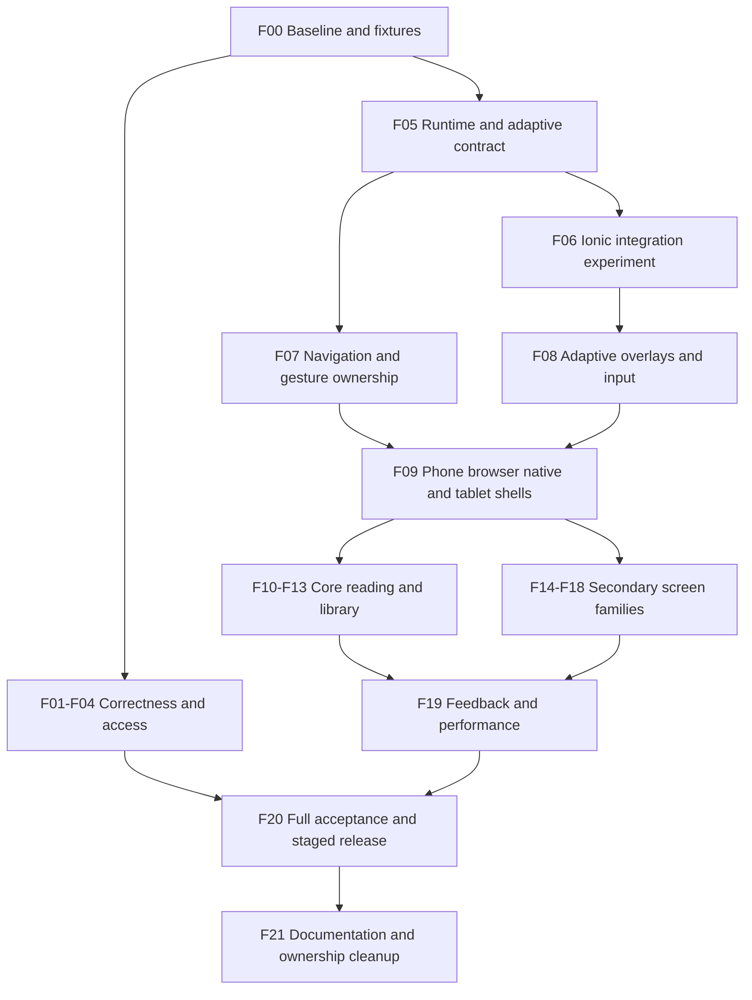

# Implementation sequence and work ledger

The research/documentation pass is complete. Ticket specifications below describe the original baseline and intended changes; the work ledger and [implementation tracker](13-implementation-tracker.md) record actual progress. Unrecorded tickets remain **not started**. Estimates below are relative scope, not delivery promises. Small means one focused behavior/component; medium means a screen family; large means a platform integration or coordinated set of surfaces. Assign a human/agent owner and actual effort after baseline capture.

Current checkpoint: **[CR06b - Route recovery and Library action names](27-route-recovery.md), implemented and verified within scope; stopped for user review, uncommitted.** CR06a is committed in `182230f`. RS05/RS06/RS07 have 77 browser passes/one documented Windows WebKit skip, 8 Library regressions, 81 auth/setup units, passing types/lint/build and retained evidence. Next: CR06c shell utility/loading consumers. Remaining CR06, CR07-CR10 and main screen acceptance stay open. No stage/commit made.

## Sequence

Treat this as dependency order, not a waterfall: accessibility, motion-off behavior, failure states and tests belong in each slice. Correctness fixes can ship independently of Ionic. A failed Ionic experiment selects the documented existing-router/primitive path; it must not block all UI work indefinitely.

## Tickets

### F00 — Establish a reproducible baseline (medium, P1)

Inputs: 01, 02, 10, current fixtures and commands. Capture baseline commit, actual dependency versions, route inventory, primary flow recordings, bundle/route performance and theme matrix. Use deterministic local fixture data and a dedicated nonproduction account for authenticated checks. Include first-use, returning-reader, large-library and offline states. Extend fixture coverage only where existing harnesses cannot represent the task.

Acceptance: evidence distinguishes browser fixture from native; one reproducible defect case per P0/P1 ticket; no unknown metric is recorded as zero; shell/gesture ownership is mapped. Output baseline manifest and screenshots/traces with capture environment. Do not run remote migrations, create live posts, or modify personal account data to obtain fixtures.

### F01 — Preserve journal drafts until confirmed save (small, P0)

Source: `JournalEntryDialog`, `JournalEntriesList`; A03 in 02. Make asynchronous save ownership explicit. Pending blocks duplicate submission; successful persistence closes/reset draft; rejection leaves editor and content available with retry. Cancel/discard semantics are distinct from save. Test keyboard submit, delayed rejection, successful retry, close/back during pending and offline handling allowed by the existing service.

Include `useJournalEntries.addEntry/updateEntry` and `QuickJournalEntryDialog`: the hook currently catches failures without returning failure to callers. Awaiting the existing resolved result alone is insufficient. Propagate an explicit success/failure outcome through both editors, and distinguish a committed write followed by refresh failure from a failed write so retry cannot duplicate a successful entry. Remove quick-editor decoration delays without weakening result handling.

Here success means the existing durable local repository/outbox commit, not waiting for remote network acknowledgement. The UI must still distinguish saved locally/pending sync from remote confirmation. Include the narrow attachment-integrity correction in `02/A19`: selecting a replacement must not delete the original before replacement and entry persistence are safely committed; cancellation/upload/save failure retains the valid saved asset. Defer asset cleanup until the existing sync/ownership contract makes it safe, and report cleanup failure independently of save success.

Acceptance: rejected save never loses entered title/content/tags/book association; retries do not create duplicate entries; live feedback is announced once; no changes to journal backend semantics.

### F02 — Repair destination and navigation semantics (small, P1)

Source: UserProfile club links, `App.tsx` route registry, ReadingHistory interactive cards, NotFound. Use registered canonical club destination, semantic links for navigable cards and explicit app recovery with safe fallback. Preserve open-in-new-tab on web and distinguish nested menu controls from the row link.

Acceptance: each affected link resolves with direct entry and normal traversal; Enter activates and modifier-click works where appropriate; no nested interactive elements; disabled feature gates still apply; 404 offers meaningful recovery.

### F03 — Make loading/error/empty and editor labels truthful (medium, P1)

Source: UserNotificationsPopover, RichTextEditor consumers, 02/07. Notifications distinguish initial loading, empty success, error, cached refresh, pending read state. A failed mark-read must not silently swallow destination navigation; define whether open is allowed with read-state retry using existing service rules. Associate editor/input labels and validation messages programmatically. Audit profile, clubs, reviews and journal editors for the same issue.

Acceptance: no empty-success message during failure/loading; focus returns to notification trigger after dismissal; unread mutation feedback does not misstate success; editors have accessible names and error association in real AT.

### F04 — Remove action-imposed waiting and incorrect haptics (small, P1)

Source: AddBook completion delay, useHapticFeedback, ContextMenuNative/useLongPress; 06. Resolve successful add immediately to the appropriate destination or continue-add state. Celebration may continue unobtrusively without holding navigation. Use correct selection feedback and one feedback owner for long press.

Acceptance: successful save is never gated by the 1.5s decorative timeout; no duplicate haptic from one action; reduced motion and haptics-off work; reward feedback remains tied to confirmed outcomes. No currency/streak rules change.

### F05 — Separate runtime, window and capability policy (medium, P1)

Inputs: 03; current `services/platform.ts`, legacy `lib/platform.ts`, usePlatform/useIsMobile consumers. Design one observable UI environment contract reusing canonical runtime detection. Add reactive standalone state, content/window size class, input capabilities, reduced motion, safe area/viewport inputs and feature support as needed. Do not make auth platform identity depend on the new layout mode.

Acceptance: same phone viewport can render browser or native presentation correctly; iPad desktop UA does not become Electron/native; resizing split screen updates presentation without losing form/session state; keyboard appearance does not masquerade as a device/runtime change; capability absence has tested fallback.

### F06 — Prove Ionic fit with pinned dependencies (large, P1 gate)

Inputs: 03/04; installed dependency matrix and official version-matched docs. In an isolated branch or fixture, integrate one sheet/form/date presentation and one navigation-stack scenario, including real React Router integration if proposed. Record actual package versions, peer range, license/bundle impact, global styles, Shadow DOM/theming, focus, overlay stacking, scroll ownership, safe area, dynamic text and browser regressions.

Acceptance: a written adopt/limit/defer decision, a working tested representative surface, and explicit ownership map. No dual competing router roots/overlay stacks. No forced router downgrade based on an old example. If routing fails while standalone primitives pass, keep existing router and adopt only tested primitives. If neither passes, retain proven primitives and implement the platform policy without Ionic; document what evidence would reopen the decision. Do not install every native plugin from a catalogue.

Implementation decision: **DEFER the tested Ionic 9.0.5 route shell and modal**. The isolated fixture establishes compatible Router 6 peers but reproduces route lifecycle and modal keyboard-boundary failures. Keep React Router 6 and the existing Radix foundations for F07–F09. The [living decision](../ui-ionic-fit.md) defines ownership and reopening conditions; [checkpoint 16](16-ionic-fit-experiment.md) records actual commands/results and the review stop. Expected-failing adoption gates are failed requirements, even when the test runner reports a successful run.

### F07 — Unify Back, overlays and gesture arbitration (large, P1)

Inputs: 03, 06; AppBackButton/useAppBack, SwipeBackHandler/useSwipeBack, MobileHeader, native App listener. One navigation owner tracks in-app ancestry and fallback. Back resolves active keyboard/overlay/selection/draft before route history according to tested platform behavior. System edges remain system-owned unless a verified native route implementation owns them. Remove duplicate document listeners and per-move rebinding. Make listener cleanup and cancellation explicit.

Acceptance: direct link with unrelated browser history cannot accidentally leave app via in-app Back; tab histories, deep links, refresh, Escape, Android system Back and iOS swipe behave as specified; rejected swipe does not also trigger row action; browser Back remains browser Back; dirty draft/timer survives. Real-device native stack/predictive-back support is verified before claiming it.

### F08 — Establish adaptive overlays and form/date primitives (large, P1)

Inputs: 04/07 and existing date/library contracts. Define sheet/dialog/popover/page selection by task and available space. Implement naming, trigger/refocus, Escape/Back, scroll lock, dismiss guard, action placement, keyboard occlusion and reduced-motion behavior once. Skin with existing semantic theme tokens. Preserve date-only and direct historical year entry.

Acceptance: nesting is intentional and tested, not accidental focus traps; compact and tablet keyboards leave controls usable; large text can convert a sheet to full-height scrollable presentation; no inaccessible custom widget replaces a tested one; date fixture passes with bounds/locale/forced colors/nested focus preserved.

### F09 — Deliver phone, browser, tablet and desktop shells (large, P1)

Inputs: 03 and F05/F07/F08; Ionic decision from F06. Keep native compact bottom tabs; implement compact browser header/destination surface; installed PWA has app-like chrome with web capability boundaries. Medium native/PWA tablets retain touch-first bottom tabs by default; use rail/sidebar on expanded windows when pane fit supports it, as specified in 03. Integrate timer/sync affordances without stacking floating bars. Centralize chrome occupancy and safe-area arithmetic.

Acceptance: no fixed 24px ornamental gap below app tabs; labels are visible; browser task space improves with browser chrome shown and hidden; keyboard does not carry irrelevant tabs upward; one vertical page scroller, no double safe-area padding; focus never hidden by chrome; actual large text and rotation pass. Bounded chrome may scroll independently at extreme text/short heights. Existing primary route identities and feature-gated destination set stay stable. Real browser toolbars, native IME/insets and physical rotation remain device acceptance gates beyond synthetic viewport checks.

### F10 — Simplify Library and Lists (large, P1)

Inputs: S06/S11 in 05, 04; library regression contracts. Merge redundant status selection; retain counts; adaptive controls for sort/view/genres/selection with visible active state and reset. Reduce per-book action chrome while preserving direct primary action, More, selection, reorder and three library modes. Lists get visible create/manage flow and trustworthy pending/success/error feedback.

Acceptance: users find a book, filter/reset, change view, add to list and exit selection without hidden gestures; accessible reorder alternative works; no drag-click navigation; filter/scroll persist after details; large library and keyboard focus work with virtualization if measured necessary. Browser and touch equivalents remain functional.

### F11 — Prioritize Book Detail and reading capture (large, P1)

Inputs: S08/S09, must-win screens, progress and session contracts. Move Start/Resume/Log into early reachable layout/DOM order. Group management under More. Keep active session, progress history, journal and review discoverable. Build adaptive split layout only when content width permits; preserve route and selected tab/draft during pane collapse.

Acceptance: first-time/returning reader sees correct reading action in the initial compact view at normal text, and can reach it promptly at large text without clipping; saving offline is clear; completion is once-only; cancel/correction differs from logging; foreground/background/rotate/resume don't lose session. No timer calculation rewrite for visual convenience.

### F12 — Refine add/search/scan/import (medium, P1)

Inputs: S07; current acquisition contract. Search-first with explicit scan/manual alternatives and recovery from denied permissions/no results/duplicates. Optional metadata belongs in disclosure; significant forms use durable draft state. Native scanner integration remains behind hooks; browser camera/keyboard fallback retained.

Acceptance: add/search/manual/scanner outcomes converge on the same identity rules; permission deny is recoverable; save visible above keyboard; duplicate opens/restores existing entry appropriately; file/camera cancellation leaves draft intact; success is local and immediate.

### F13 — Focus Home, goals and reading history (medium, P1)

Inputs: S05/S10/S12 in 05; existing dashboard read model. Lead Home with Continue Reading/Start and restrained progress summary; disclose deeper stats. Goals use clear period/target/state; history supports direct record access and correction without inviting duplicate capture. Preserve current query contracts.

F13 also owns the full S10 journal/notes/quotes/reflection composer experience after F01 repairs persistence: focus and keyboard toolbar behavior, accessible editor labels, retained draft context, attachment selection/replacement/cancellation safety, and compact/tablet presentation. Keep the previous attachment until replacement succeeds; failed upload or save must not discard the valid prior content. Split this coherent composer work into a child ticket if needed rather than leaving it unowned.

Acceptance: no duplicated local progress/reward totals with inconsistent freshness; useful cached content retained on refresh; goal date constraints preserved; semantic history navigation; chart/table alternatives. Profile rendering before removing subscriptions or changing data queries.

### F14 — Social, clubs, readers and reviews (large, P2)

Inputs: S14–S16 in 05. Simplify feed hierarchy, group secondary actions, preserve drafts, provide explicit publishing states and contextual moderation/reporting. Clubs organize reading/discussion/member/admin tasks; permissions still service-owned. User profiles emphasize relevant reading/social actions without duplicating every dashboard stat.

Acceptance: publishing failures preserve content; repeated taps don't duplicate posts; reactions have pressed state and restrained motion; reporting/privacy remain discoverable; social-disabled state blocks destinations and content consistently; full screen-reader traversal passes.

### F15 — Messages and notifications (medium, P1/P2)

Inputs: messaging section in 05, F03, F07/F09. Decide durable conversation identity, preserve existing entry intents, and introduce compact list/detail plus adaptive split pane when it fits. Keep composer accessible above keyboard; own scroll anchoring and unread state explicitly. Notifications use full readable list/destination behavior appropriate to space.

Acceptance: direct thread entry, reload, back, resize and rotation retain correct conversation; new message does not steal scroll/focus from reading older messages; drafts preserved; pending/failed send distinguishable; narrow tablet is not forced into an unusable 22rem inbox plus detail.

### F16 — Settings, profile and accessibility preferences (medium, P1/P2)

Inputs: 05/07. Compact category-to-editor navigation, wider category/detail only when it fits. Reuse profile form. Add narrowly useful app preferences for reduced effects/celebrations/haptics where supported, respecting system settings by default. Accessibility semantics are always present; never add an “enable screen reader” dependency.

Acceptance: preferences persist under existing account/device ownership conventions and react without restart; preserve the current instant-apply theme-selection behavior and existing choice; save errors preserve edits; all settings can be operated without gesture, sound, sight or mouse. A transactional theme preview would be a separately proposed interaction change, not an assumed requirement. Do not promise to enable OS VoiceOver/TalkBack from a website.

### F17 — Journey, achievements and analytics (large, P2)

Inputs: 05/06; existing journey rules. Reduce simultaneous metric/badge/action emphasis; keep reward concepts accurate and freshness visible. Charts answer one question at a time with data summaries/tables. Optional rich milestone visuals happen after meaning is clear and never block interaction.

Acceptance: offline/provisional vs confirmed reward states match services; no fabricated XP; no replay on refetch/navigation; charts can be understood without color/hover; no focus loss from count animation; performance budget on representative large data.

### F18 — Public entry, auth, onboarding, support and recovery (medium, P1/P2)

Inputs: S01–S04 in 05; auth callback and native permission contracts. Preserve expressive public branding with lighter interaction motion. Keep input labels/password managers/keyboard usable; onboarding remains resumable and meaningful. Support uses honest content and recovery routes; legal placeholders are not presented as approved policies.

Auth/onboarding entry, validation, draft, keyboard and accessibility defects are P1 and may proceed immediately with F01–F04 when source evidence supports them; marketing/support visual polish is P2. Do not defer a core entry blocker until all secondary screen work is finished merely because this ticket appears later in the list.

Acceptance: native entry resolves to app flow appropriately; marketing page retains web SEO/links; auth redirect contracts unchanged; challenge failure/expired reset/offline access explained; existing legal content dependencies recorded; no mandatory permissions to continue normal use.

### F19 — Consolidate motion and remove measured bottlenecks (large, P1/P2)

Inputs: 06 and traces from F00/F09–18. Apply loader lifecycle, localized saving feedback, reward queue, route transition ownership and reduced-motion contract. Profile actual long tasks, JS work, image decoding, layout and cache invalidation before optimization. Lazy-load optional effects/charts only where useful; avoid repeated entrance animation on mounted lists.

Acceptance: candidate budgets in 10 met or exceptions supported by traces; no artificial navigation holds; interruption/reduced motion verified; start/end states identical with effects disabled; input remains responsive during rewards; no new eager heavyweight imports to shell without measured need.

### F20 — Acceptance, usability and staged release (large, release gate)

Run the matrix in 10. Compare core-task completion, findability, accidental taps, readability and perceived speed with baseline, including disabled participants where available. Record blockers rather than averaging away exclusion. Release shell changes behind an existing appropriate frontend flag if available; otherwise add one narrowly scoped reversible presentation switch, not a competing persisted app architecture.

Acceptance: no open P0/P1 functional or accessibility release blocker in affected scope; real iOS/Android/tablet evidence; browser/PWA/Electron smoke checks; documented rollback; approved legal content where required for the release. A failed library migration can revert presentation without reverting or corrupting reader data.

### F21 — Update living docs and retire obsolete ownership (small/medium)

After each shipped slice, update current-behavior docs, source maps, tests and ticket evidence. Remove superseded listeners/components/dependencies only after consumer search, runtime checks and rollback window. Update existing Graphify locally after code changes; refresh generated exports only with approved local-only commands. Do not hand-edit generated vault content.

Acceptance: dossier distinguishes implemented from proposed, current docs stop instructing obsolete APIs, no dead duplicate owner left active, concise skills point to authoritative detail. Keep baseline audit historical rather than rewriting findings as if they never existed.

## Work ledger template

For every ticket append a row to the implementation record; initialize only when work actually begins:

| Ticket | Owner | Status | Source commit | Changed files | Checks/evidence | Remaining risk | Next step |
| --- | --- | --- | --- | --- | --- | --- | --- |
| F00 | Baseline work | source inventory exists; full baseline incomplete | Original audit plus `db076cf` census | [Coverage correction](20-coverage-reconciliation.md) | Source census and limited historical screenshots; no complete actual-font/state/performance/device baseline | Cannot infer visual/native/performance success from fixture totals | Capture relevant baseline before each corrective unit; retain release/device gates |
| F01 | Prior implementation | implemented/browser-verified and committed | `229dd677e33a8b7c6e81ac31d75b34aa94ea728d` | See [historical tracker](13-implementation-tracker.md) and [current contract](../ui-journal-editing.md) | Original 54 Playwright, 74 client and 8 desktop checks; journal browser 54 rerun passed in F02/F03 batch | Native/AT/live sync unverified; draft recovery is process-memory only | Preserve the contract during later changes |
| F02 | Prior implementation | named repairs committed; broader recovery acceptance open | `06d519044155d1cb1d9f6e6ab3a0e23a2397e801` | [Historical checkpoint](14-next-implementation-batch.md), [CR06a](26-social-destinations.md) | Original27 navigation cases within combined63; CR06a adds actual social destination consumers with scoped evidence below | Remaining route branches, focus/scroll and native/AT acceptance; catalog/Dashboard receipts are not destination UI | Continue CR06b; preserve existing fixes |
| F03 | Prior implementation | named repairs committed; live consumer coverage open | `06d519044155d1cb1d9f6e6ab3a0e23a2397e801` | [Historical checkpoint](14-next-implementation-batch.md) | 36 notification/editor Playwright cases within original combined63; journal54; historical focused checks | CR01 live writing/media repairs committed in93b63bc; CR02 creation work tracked in22; other form consumers and AT remain open; ReviewComments is unwired | Remaining corrective consumer batches |
| F04 | Prior implementation | named repairs committed; caller coverage open | `2ddc1c25c3b453a5b3f923c99f4d3e58b45b7754` | [Historical checkpoint](15-feedback-environment-batch.md), [contract](../ui-action-feedback.md) | Historical60 Playwright,45 focused and117 regressions; types/lint/build | Live duplicate/bypass haptics, onboarding wait and unwired BookCard long-press branch; hardware unverified | CR08; correct gesture evidence scope |
| F05 | Prior implementation | environment foundation committed; consumer adoption incomplete | `2ddc1c25c3b453a5b3f923c99f4d3e58b45b7754` | [Historical checkpoint](15-feedback-environment-batch.md), [contract](../ui-environment.md) | Historical33 Playwright,35 focused and117 regressions; types/lint/build | Responsive task replacement in Settings/Messages/header consumers; physical runtime unverified | CR02–CR06 adoption and state retention |
| F06 | Prior batch | experiment approved and committed; production adoption deferred | `f90509d9ee2092e872d91933020a4a71deb4798a` | [Historical checkpoint](16-ionic-fit-experiment.md), [decision](../ui-ionic-fit.md) | Exact checks, ordinary passes and declared gate failures are recorded in checkpoint 16 | Tested route lifecycle and modal keyboard gates fail; native/AT unverified | Preserve existing router/primitives |
| F07 | Prior batch | coordinator/selected consumers committed; coverage open | `83e032bfc77d240b545cbbbc2a091ceac76538b0` | [Historical checkpoint](17-back-ownership.md), [Back](../ui-back-navigation.md), [gestures](../ui-local-gestures.md) | Historical194 focused tests and eight matrices; exact passes/skips/retries in17 | Live independent swipes/chapter Back and route branches remain; native/device acceptance pending | CR05/06; source-to-entry evidence for every handler |
| F08 | Previous batch | adaptive foundation/listed migrations committed; coverage open | `bd342dc` | [Historical checkpoint](18-adaptive-overlays.md), [surface contract](../ui-adaptive-overlays.md) | Historical198 focused and234 distinct browser checks; documented diagnostics | Ordinary dialog/confirmation/field consumers, parent remounts and pending/dirty rules remain | CR01–CR07; overlay matrix dispositions and actual-parent evidence |
| F09 | Previous batch | shell changes committed; cross-application acceptance reopened | `db076cf` | [Historical checkpoint](19-adaptive-shell.md), [screenshots](evidence/f09-shell/README.md) | Historical134 focused and303 distinct browser checks; warnings/failures recorded in19 | Omitted live task parents, Support/404 utilities, tablet actions, cold App fallback; physical/visual acceptance unverified | Active20 and CR02–CR09 before routine F10 |
| CR01 | Prior batch | committed, scoped verification preserved | `93b63bc` | [Historical checkpoint](21-live-composers.md) | 73 unit;75 distinct composer browser cases via73/75 +6/6 rerun;63 shell; types/lint/build;20 screenshots | Physical devices/AT/live service and whole-screen visual debt remain assigned | Preserve repaired writing/media behavior |
| CR02 | Prior batch | committed, scoped verification preserved | `4dadc37` | [Historical checkpoint](22-responsive-composers.md), [screenshots](evidence/cr02-responsive-composers/README.md) | 84 unit; 78 distinct browser cases via 76/78 +9/9 follow-up; 45 shared regressions; types/lint/build | Three actual creation entries covered; original failures retained; physical devices/AT and F14 composition remain open | Preserve repaired creation task ownership |
| CR03 | Prior batch | committed, scoped verification preserved | `74ed7d7` | [Historical checkpoint](23-settings-continuity.md), [Settings contract](../ui-settings-tasks.md) | 95 distinct units / 12 files; 87 distinct Settings browser cases via 83/87 full run +18/18 after fix +3/3 WebKit repeat; shared shell21/21 and overlay15/15; client/fixture types, changed lint and final build; final graph/Obsidian export | Original failures preserved; follow-ups overlap rather than add new cases. Native/AT, performance and F16 composition remain open | Preserve Settings task contracts during CR04 |
| CR04 | Prior batch | committed, scoped verification preserved | `ef5b2f9` | [Checkpoint24](24-library-list-tasks.md), [Library/list contract](../ui-library-list-tasks.md) |117 distinct units;97 actual-task passes/2skips;33 Library regressions/6skips;21 shell regressions; types/lint/build; graph/Obsidian/census | Original full browser run92pass/2fail/2skip followed by16pass/2skip focused correction; native/AT/performance and F10 composition remain | Preserve Library/list contracts during CR05 |
| CR05 | Prior batch | committed, scoped verification preserved | `a610871` | [Checkpoint25](25-messages-layout-gestures.md), [Messages contract](../ui-messages.md) |138 units/7files;59 distinct browser passes/4CDP skips via full run and30-case final correction;30 retained captures; client/fixture types, lint, build; graph/Obsidian/census | Original failures and visual-check gaps retained; main F15 URL/notification/composition and native/AT/performance acceptance remain | Preserve Messages task/gesture contracts |
| CR06a | Committed child | implemented/verified within scope; historical | `182230f` | [Checkpoint26](26-social-destinations.md), [navigation contract](../ui-navigation-notifications.md) |67 distinct browser passes/two reproduced Windows WebKit skips;32 units/3files;37 retained captures; client/fixture types, lint, build; graph/Obsidian/census | Original failures preserved. Actual social card consumers covered; remaining shell/recovery, native/AT/performance and F14 composition are open | CR06b now recorded below; remaining CR06 stays open |
| CR06b | Current child | implemented/verified within scope; review stop | `182230f` + uncommitted worktree | [Checkpoint27](27-route-recovery.md), [manifest](evidence/cr06b-route-recovery/verification.json) |77 browser passes/one Windows WebKit skip;8 Library regressions;81 auth/setup units;types/lint/build;70 retained captures;graph/Obsidian/census | Controlled services; no native/AT/performance/global visual acceptance; original failures retained | User review; then CR06c utility/loading consumers |

Use `verified` only for completed acceptance in the specified environment; `shipped` requires actual deployment/release evidence. Native-unverified work can be browser-verified without pretending the entire ticket is done.

## Rollout and rollback rules

- Prefer self-contained correctness fixes first, then one complete core screen with the new shell/primitives, then screen families. Avoid a half-migrated overlay or back stack.
- Keep service, storage, route and theme identifiers stable so presentation rollback is possible without a database migration.
- Compare the same fixtures and real-device scenarios before/after. If shell history, draft, timer, a11y or sync integrity regresses, disable/revert the affected presentation slice immediately.
- Preserve unknown/unverified flags in release notes. A browser pass does not waive required native testing.
- Do not combine dependency-major migration, speculative folder restructuring and product IA renaming with the initial shell release. The Ionic gate determines the minimum dependency change needed.
